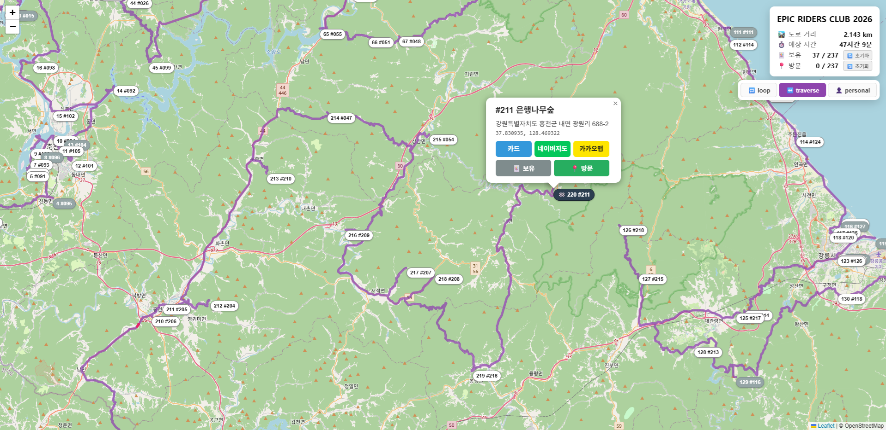

# EPIC RIDERS CLUB 2026

BMW Motorrad Korea EPIC RIDERS CLUB 2026 강원도 220 + EPIC 17 = 237장 카드 지도 생성 도구.

라우트 세 가지를 모터사이클 합법 도로(고속도로 제외) 위에서 계산해 HTML 한 파일로 출력한다.

[](https://xoonjaeho.github.io/epic-riders-club-2026/)

🗺️ **[라이브 데모 ↗](https://xoonjaeho.github.io/epic-riders-club-2026/)** — 마커 클릭 시 카드 정보 / 네이버지도 · 카카오맵 길찾기 링크. 보유·방문 토글은 브라우저 LocalStorage 에 저장.

| 모드 | 설명 | 색상 |
|------|------|------|
| 🔁 loop | 220장 모두 방문 후 시작점 복귀 (TSP closed) | 주황 #e67e22 |
| ↔️ traverse | 220장 모두 방문, 도착점 자유 (TSP open) | 보라 #8e44ad |
| 👤 personal | 보유 카드만 방문 (TSP open) | 파랑 #2980b9 |

## Quick Start

```
.\run.bat
```

브라우저로 http://127.0.0.1:8804 접속.

## 기능

- 237장 카드 보유 🃏 토글 (LocalStorage 영구화)
- EPIC 비공개 17장 좌표 사용자 입력 → `data/epic_coords.json` 영구화
- 지도 마커 클릭으로 ⭐ 시작 / 🏁 도착점 지정 (모드별 독립)
- TSP 시간 · 검증 모드(intersect/point/off) · buffer · bearing 임계값 · grade-separation 필터 · 메타휴리스틱 선택 등 전체 파라미터 노출
- 생성 진행률 SSE 실시간 스트림
- 캐시 자동 재사용 + 🔄 수동 무효화 버튼
- 생성된 HTML 다운로드

## 파이프라인

1. **그래프 빌드** — Overpass API에서 강원 일대 모터사이클 합법 도로를 16개 bbox로 분할 수집 (`overpass_cache/`). highway=motorway 등 제외. coord-based 노드 dedup + **방향성 edge** 저장: `oneway=yes/true/1/-1/reverse` 와 암묵적 `junction=roundabout` 을 `parse_oneway` 가 해석해 합법 방향만 그래프에 추가. 양방향 way는 `(u,v)`/`(v,u)` 두 edge, 일방통행은 한 방향만. 동일 directed `(u,v)` 다중 way 는 최단 길이로 coalesce.
2. **Snap** — 카드 좌표를 그래프 최근접 노드로 매핑.
3. **Matrix (Dijkstra)** — 모든 카드 쌍에 대한 거리 행렬을 `directed=True` sparse Dijkstra로 계산 — 일방통행 역주행 라우팅을 차단. `mc_dijkstra.npz`에 predecessor 배열까지 보존(폴리라인 복원용). 도달 불가 페어가 있으면 `unreachable_count` + 샘플을 진단 정보로 노출.
4. **TSP** — OR-tools constraint_solver. PATH_CHEAPEST_ARC 시드 + GLS/SIMULATED_ANNEALING/TABU_SEARCH 메타휴리스틱 중 최소값 채택.
5. **Polyline** — TSP order별로 인접 노드 간 Dijkstra 경로 복원 → Google polyline encode.
6. **Duration** — 노드 그래프의 maxspeed 또는 highway 기본값으로 leg별 소요 시간 산출 (10–110 km/h clamp).
7. **검증** — `intersect` 모드: 라우트 buffer(3m)과 restricted way(LineString) 기하 교차 길이 측정. grade-separation 필터(bridge/tunnel/layer), bearing 차이 30° 초과 → 합류/교차 false-positive로 제외.
8. **HTML** — Leaflet + 마커 + 폴리라인 + 위반 핀크 오버레이를 single-file로 직렬화.

## API

| Method | Path | 용도 |
|--------|------|------|
| GET | `/` | UI 인덱스 |
| GET | `/api/cards` | 카드 + EPIC + 보유 기본값 |
| PUT | `/api/epic` | EPIC 좌표 영구 저장 |
| POST | `/api/build` | 파이프라인 시작 → job_id |
| GET | `/api/job/{jid}` | 작업 상태 스냅샷 |
| GET | `/api/job/{jid}/events` | SSE 진행 스트림 |
| GET | `/api/download/{jid}` | 산출 HTML 다운로드 |
| GET | `/api/status` | 캐시 상태 |
| POST | `/api/rebuild-graph` | 그래프/매트릭스 캐시 삭제 |

## 파일 구조

```
epic-riders-club-2026/
├── main.py                  # FastAPI entry
├── pipeline.py              # build/verify/html orchestrator + JobManager
├── build_motorcycle.py      # 그래프 + 매트릭스 + TSP + 폴리라인 + 소요시간
├── verify_motorcycle.py     # intersect/point 검증
├── build_html.py            # HTML 산출
├── spots.json               # 220장 공개 카드
├── owned.json               # 기본 보유 (LocalStorage 초기값)
├── data/epic_coords.json    # EPIC 17장 사용자 좌표 (자동 생성)
├── static/                  # 프론트엔드
│   ├── index.html
│   ├── styles.css
│   └── app.js
├── out/                     # 생성된 HTML (gitignore)
├── run.bat
├── requirements.txt
├── CLAUDE.md
└── README.md
```

## 캐시

| 파일 | 크기 | 무효화 시점 |
|------|------|-------------|
| `overpass_cache/chunk_NN.json` | ~5 MB × 16 | 수동 삭제 또는 그래프 재빌드 |
| `mc_graph.json` | ~210 MB | 그래프 재빌드 시 |
| `mc_dijkstra.npz` | ~3 GB | 매트릭스 재빌드 시 |
| `matrix_motorcycle.json` | ~1 MB | 카드 좌표 변경 자동 / 매트릭스 재빌드 시 |

EPIC 좌표를 추가하거나 변경하면 `spots_key` 해시가 바뀌어 매트릭스가 자동 재계산된다(~90초). 그래프는 유지. `spots_key` 는 **순서 민감** — 매트릭스가 위치 인덱스 기반(`matrix[i][j]` = `spots[i]→spots[j]`)이라 spots 리스트 reorder 만으로도 캐시 미스가 발생해야 정합성이 보장된다.

`mc_graph.json` 에는 `schema_version` 필드가 기록되며, 알고리즘 변경으로 스키마가 bump 되면 (현재 v2 — 방향성 edge) 다음 빌드 시 그래프 + 매트릭스가 자동 무효화·재빌드된다. Overpass 캐시는 보존되므로 네트워크 재호출은 발생하지 않는다 (~2분).

## 의존성

- Python 3.10+
- 자세한 패키지는 `requirements.txt`

## 라이선스

### 코드
[MIT License](LICENSE) — 자유롭게 사용·수정·재배포 가능 (저작권 표기 유지).

### 외부 데이터
- **도로 그래프**: [OpenStreetMap](https://www.openstreetmap.org) contributors — [ODbL](https://opendatacommons.org/licenses/odbl/) 라이선스. Overpass API 경유로 강원 일대 도로 데이터를 수집·캐시 (`overpass_cache/`, gitignored).
- **BMW EPIC RIDERS CLUB 카드 정보** (`spots.json`의 220장): BMW Motorrad Korea의 EPIC RIDERS CLUB 2026 캠페인 데이터. 명소 위경도·주소는 공개 사실 정보이며 카드 번호 체계 및 큐레이션은 BMW Motorrad Korea의 콘텐츠입니다.
- **EPIC 17장** (`data/epic_coords.json`): 사용자가 직접 입력한 좌표 — 본 레포는 좌표 없는 템플릿만 포함.

본 프로젝트는 비공식 팬 프로젝트이며 BMW Motorrad Korea 와 직접적인 연관이 없습니다.

### 의존성 라이선스
- [FastAPI](https://fastapi.tiangolo.com), [Leaflet](https://leafletjs.com) — MIT / BSD
- [OR-tools](https://developers.google.com/optimization) — Apache 2.0
- 기타 패키지는 `requirements.txt` 참고.
